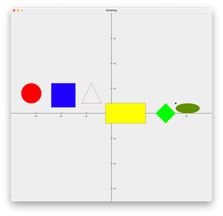
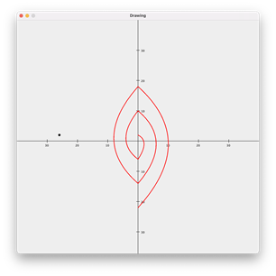
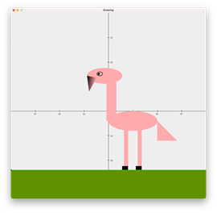

# DotPaint++

DotPaint is a simple, grid-movement and point-shaped, based language that allows for a modular approach for the task of drawing to accommodate users of different ages and subsequently various levels.
   
#### Advantages of our language:
* Extremely easy to learn and highly intuitive. With our user friendly experience and simple syntax, anyone can get started on making beautiful drawings right away. Plain English words are used as commands, and functions have both a short version that specifies the minimal requirements needed to execute a function along, as well as a longer version that includes additional arguments of incremented complexity to address the needs of more experienced users.  
* Language dedicated specifically for drawing. In comparison to other languages, where drawing is just an additional feature, DotPaint++ is built directly to support the complexity of various drawing toolkits by utilizing simple commands. 
* No variables, case-insensitive, highly flexible. The language does not require programmers to understand complex data structures and various concepts. By using dots on the grid as a building block, programmers can build the most complex shapes by just knowing what they look like. Place a few points on the map and you already can make anything from a simple triangle to complex polygons and ovals.  
* Best for learning. Kids can quickly get familiar with writing programs and drawing complex shapes by just moving in various directions. The language is so intuitive it can be quickly adopted by kids without any prior knowledge or experience.  
* Great for professionals. Even though the syntax is so simple and intuitive, it can be quickly extended by the large library of functionalities. From complex filling and gradient options, to curving the lines, the language offers great flexibility in terms of its user base.  

### Implementation

The system works with the help of Sablecc and Java Graphics2D. Firstly, the grammar for the language is defined in the grammar.txt file. Then, the grammar is produced into the language called graphlang. Inside, the semantic analyzer takes care of actually handling the drawing tasks by importing the Graphics2D module. It works by taking the input program from the user and then making use of the compiled node classes, which serve as a base for the language. The commands are then rendered and displayed as an image. 
   
#### Execution:
* Java 16 is used to compile the project.
* cd to the folder where the project is located
* execute either “java Runner” or “java -jar run.jar”
 
#### Usage:
* Type commands in the text field
* To run the file click on File and then Run
* To empty the editor click on File and then New File
* To get access to the basic manual with some simple commands press of Help

### Sample Programs

| | | |
|:-------------------------:|:-------------------------:|:-------------------------:|
| |  ||

